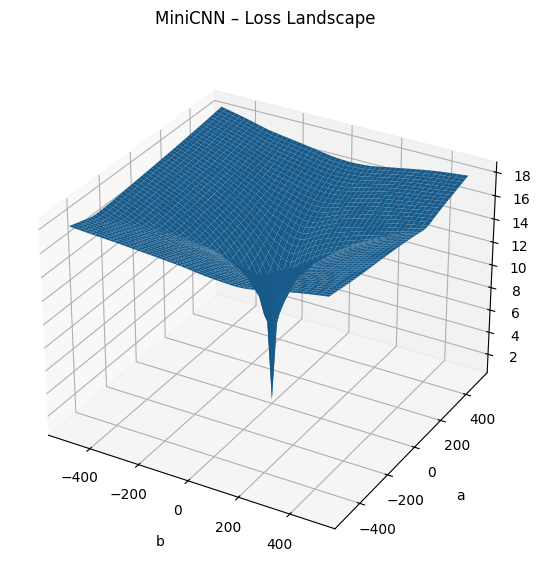
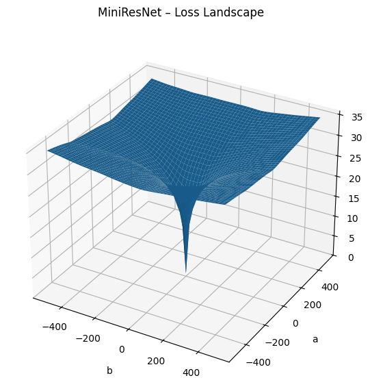
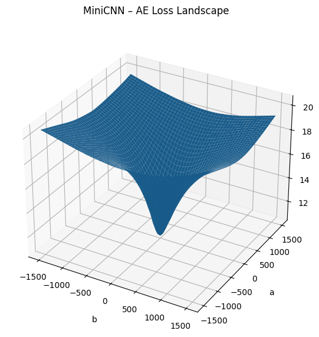
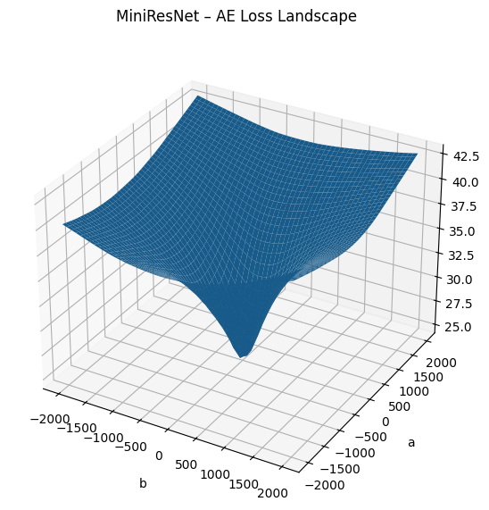

## Geometry-Preserving Dimensionality Reduction for Visualizing Loss of Neural Networks

### Setup

To install the same set of packages used to implement this project, run

```bash
conda env create -f environment.yml
```

This project also uses torch 2.8.0+cu129 and torchvision 0.23.0+cu129. These must be installed separately.

### Loading Base Models and Autoencoders

Since large files can not be saved on GitHub, the model weights for the ResNet and CNN models trained, as well as a few other models used in early experimentation, can be found with the following drive link. The model weights for the autoencoders can also be found there. Please download these files to a directory named `models/` in the root directory for everything to work as intended. Alternatively, you can use the scripts provided to train the models from scratch.

Model link: https://drive.google.com/drive/folders/1IXGw31f3xzLHAfiXX7nR3R5EmkNtDbEy

### Recreating Results

To recreate the loss landscape visualizations visualized below, you can simply follow the script ```LossVisualization.ipynb``` after downloading the above model weights.

Alternatively, you can train all the models from scratch as follows:
- Create directories `data/` and `models/` in the root directory
- Train the MiniCNN and MiniResNet on CIFAR10 using ```train_baselines.ipynb``` 
- Sample parameter/loss pairs from MiniCNN and MiniResNet using ```loss_sampling.ipynb```
- Train the geometric autoencoder for the MiniCNN and MiniResnet using ```train_autoencoder.ipynb```
- Visualize the loss landscapes with ```LossVisualization.ipynb```

You can also replace the MiniCNN and MiniResNet with any other models of your choosing. Note that for large models storing the vector representation of the weights when sampling from the loss landscape may take up substantial storage and plan accordingly.

### Loss Landscape Visualizations
The following are visualizations of the loss landscapes of the ResNet and CNN based models with the weights from above using a standard and autoencoder mapping:




